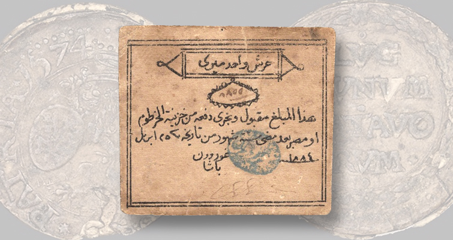

## The art of the peg

Though the history of crypto is short, we've already seen multiple stablecoin depegs. The first question is always "what happened to the reserves?" - and this is by and large the most prolific failure mode we have seen to date. UST's death spiral in May 2022[^ust], USDT wobbling to 95 cents in the contagion that followed[^usdt], USDC sliding to 87 cents over the SVB collapse weekend[^usdc]. All lost their peg because the market stopped trusting the backing. When someone says "the stablecoin depegged", this is what they mean. The issuer drifted - the reserves are blown, or were never there, and the illusion of redeemability is shattered. The coin is now worth less than a dollar because the issuer is worth less than a dollar.

_An early form of UST_

Given the proliferation of stablecoin issuers, the growth of alternative venues and the need for interoperability, I would like to posit a second type of stablecoin failure mode - which is less about the coin and more about the chain. In this scenario, the issuer is fine. The reserves are fine. The peg is fine. But your USD stablecoin on chain X is worth less than your USD stablecoin on chain Y. You may already be familiar with this phenomenon as the basis between USDC on Arbitrum and USDC on mainnet, or the arb between USDT on Tron and USDT on ethereum. Many play the game of bips here and successfully leverage it into millions of profit. But for the average user, it's a trap! You thought you were holding a stablecoin, but you were really holding company scrip(!). The chain is the company store, and the company store sets the prices.

## What controls venue drift

There are a few factors that influence on chain venue drift in stablecoins. A wise man once told me that price is a factor of risk and time - you'll see both listed below in what _I believe_ is the order of importance:

**Exit infrastructure.** The big one. Does the chain have native CCTP, a canonical bridge, or only third-party bridges? The distinction that matters isn't canonical versus third-party, but more burn-and-mint versus lock-and-mint. A token burned on the source and natively minted on the destination is the issuer's own liability on both ends — no wrapper, no locked collateral — so the cross-chain basis is bounded by the cost of burning and minting your way out. A token that arrived by locking collateral in a bridge contract is a claim on that collateral, custodied by the bridge; closing its discount means trusting the bridge, so when the bridge is in doubt the basis has no floor. 

It's also worth noting that the compliance burden of operating exit infrastructure tends to be higher in practice than operating the token itself. The token is, traditionally, an ERC-20 (or equivalent) with a couple of blunt admin levers - Circle reaches for `blacklist()` rarely, and it's surgical and upstream, since a blacklisted address can't even burn. The exit is where the continuous machinery lives: every burn depends on Circle's centralised attestation service, the CCTP contracts carry their own denylist, and a finalised burn is never a guaranteed mint. The bridge is the choke point - not a token they have to freeze, but a permissioned rail they have to run.

**Redemption queue capacity per chain.** Extending the above, issuers ration throughput. CCTP's Fast Transfer Allowance (As an example - it is a great bridge, and therefore easy to use!) is a per-chain escrow cap - when it's drawn down, fast transfers fall back to standard finality and you wait. And finality itself differs per chain: an Ethereum burn settles on a different clock than a Solana one. When the fast lane is full or the source chain is slow, the basis opens up while you wait.

**Withdrawal delays.** L2 fast bridges versus optimistic 7-day exits. Time is a basis. The longer you're trapped, the wider the spread someone will demand to take you out early. This is the reason why CCTP is so powerful - it gives you the option to exit immediately at par, rather than waiting for the market to offer you a price. But if CCTP isn't available, your time in the company store is a function of the exit infrastructure, and the basis is a function of that time.

**Censorship and sequencer monopoly.** Centralised sequencers (i.e, in the case of an L2) can in principle ration access to exit transactions. They mostly haven't, but the option is sitting there. A chain that can throttle your exit is charging you, even when it doesn't. The ceiling on this is L1 force-inclusion: on most rollups you can eventually push a transaction through the L1 escape hatch if the sequencer stalls you, so censorship is bounded to a delay rather than an outright block. But a delay is still a basis - a chain that can make you wait to leave sets a floor under the spread on its coin.

**Maker inventory.** When everyone wants out of chain X at the same time, makers run out of capital on the other side. The basis blows out until inventory rebalances. The depth of the spread is a function of the depth of the maker book. In many ways, this is downstream of all the other factors. The more exit friction, the more venue drift, the more inventory risk for makers, the wider the spread.

Here's a toy model to illustrate some of the above. Two chains, the same exit demand, the same maker inventory on both sides. The only differences: Chain A has a native CCTP lane, Chain B doesn't, and Chain B's bridge is slower. (CCTP here stands in for any deep-liquidity 1:1 bridge primitive: the concept is "fast, par-clearing native exit," CCTP is just the most recognisable instance.) Crank the demand slider and watch the basis diverge.

  
Exit demand (shared)

  

    <label>Hourly demand to exit $100k/hr</label>
    <input type="range" id="vs-demand" min="10000" max="2000000" value="100000" step="10000">
  

  

    
Chain A — has CCTP

    
— bps

    
Healthy

    

      
Native lane (CCTP)0%

      

      
Maker book0%

      

    

    

      
Chain A config

      

        <label>CCTP cap $1.0M/hr</label>
        <input type="range" id="vs-a-cctp" min="0" max="2000000" value="1000000" step="50000">
      

      

        <label>Maker inventory $500k</label>
        <input type="range" id="vs-a-inv" min="0" max="2000000" value="500000" step="50000">
      

      

        <label>Bridge cycle 1.0 hr</label>
        <input type="range" id="vs-a-cycle" min="0.5" max="6" value="1" step="0.5">
      

    

  

  

    
Chain B — no CCTP, slow bridge

    
— bps

    
Healthy

    

      
Native lane (none)0%

      

      
Maker book0%

      

    

    

      
Chain B config

      

        <label>CCTP cap $0/hr</label>
        <input type="range" id="vs-b-cctp" min="0" max="2000000" value="0" step="50000">
      

      

        <label>Maker inventory $500k</label>
        <input type="range" id="vs-b-inv" min="0" max="2000000" value="500000" step="50000">
      

      

        <label>Bridge cycle 1.5 hr</label>
        <input type="range" id="vs-b-cycle" min="0.5" max="6" value="1.5" step="0.5">
      

    

  

  
Basis curve vs demand

  <svg class="vs-chart" id="vs-chart" viewBox="0 0 600 220" preserveAspectRatio="xMidYMid meet"></svg>
  

    Chain A
    Chain B
    Current demand
  

  Toy model. Basis = risk floor + native-lane congestion (cubic in utilization) + maker spread once you spill over (a base premium that scales with the bridge cycle, plus a convex penalty as the maker book saturates). No quote when spillover demand exceeds what makers can serve given inventory and cycle. Curves clip at 500 bps; "no quote" appears as a vertical dashed line where the curve drops off. Real markets are messier (multiple makers with discrete books, inventory rebalancing across many chains, MEV, depeg risk priced in) but the shape is the lesson: flat, then convex, with a cliff.

## Likely outcomes

Two paths:

**More extractive.** Every issuer launches their own chain. That's already happening (Plasma, Stable, Codex, Tempo, Arc). And now every payment rail launches their own stablecoin. Stripe spent $1.1B on Bridge in 2024. Mastercard bought BVNK earlier this year. Coinbase already runs a white-label stablecoin service and a chain. The reported Stripe-Visa-Mastercard stablecoin platform - with Coinbase said to be weighing whether to join[^consortium] - is the union of those positions. Payment rails, merchant acceptance, custody, and a chain, all under one stable.

The product here isn't a USDC or even USDT competitor - a business which originally profited from regulatory arbitrage. It's a competitor to the entire issuer-only stablecoin model. Compete on yield? They won't bother. Their value proposition is *distribution*: the stable clears at par across every merchant terminal and checkout in the western world. That's the company-store model in pure form. You take the scrip because there's nowhere else to spend.

And the basis design is intentional, not accidental. A consortium that owns the rails _can guarantee_ 1:1 inside its ecosystem and shape the friction at the edges. CCTP-style escape hatches are not on the roadmap. The venue drift is the moat.

**Less extractive.** Neutral settlement infrastructure that compresses the basis. Makers who can move clean stablecoins between chains cheaply, screen counterparties, and quote the basis as their spread. The basis becomes the price of exit, paid to whoever does the work cheapest. Not a chain. Not an issuer. A market. The basis here doesn't vanish - it's still a tax — but in an open market it's competed down toward the cost of doing the work and paid to liquidity providers, not rentiers. A spread anyone can undercut rewards better exit infrastructure and more efficient markets; a moat rewards owning the captive audience. Same toll, opposite incentive.

Regulators won't bring this. Most regulatory action widens venue drift, not narrows it. Every freeze opens a new basis on tainted addresses. Every "must be issued by a state-chartered entity" rule creates a new venue. The fix has to come from market structure.

## Closing

The historical scrip didn't die because workers refused it. It died because somebody built the infrastructure that made it pointless to issue.

The on-chain version isn't dying. It's consolidating. The biggest rails and acquirers are forming a guild[^guild] - the biggest exchange circling - to issue scrip backed by the largest captive merchant network ever assembled. The company store has subsidiaries now.

What kills it is the same thing that killed it last time: convertibility. Not the legal kind (that ship sailed). The market kind. Settlement infrastructure that prices the venue basis honestly and lets you exit at fair value, no matter which chain you took the job on.

Until then, the chain is the company store, and the company store sets the prices.

[^ust]: TerraUSD collapsed from its dollar peg toward zero in May 2022 as its algorithmic LUNA backstop hyperinflated under a redemption run. <https://www.chainalysis.com/blog/how-terrausd-collapsed/>
[^usdt]: Tether fell to roughly $0.95 on 12 May 2022 amid the Terra-driven panic and renewed doubts over reserve quality, recovering after processing billions in redemptions. <https://www.coindesk.com/markets/2022/07/26/tether-finds-stable-dollar-peg-after-terras-collapse>
[^usdc]: Circle disclosed that $3.3B of USDC's ~$40B in reserves was stranded at the failed Silicon Valley Bank; USDC fell to about $0.87 on 11 March 2023 before recovering once the FDIC backstopped deposits. <https://www.cnbc.com/2023/03/11/stablecoin-usdc-breaks-dollar-peg-after-firm-reveals-it-has-3point3-billion-in-svb-exposure.html>
[^consortium]: <https://www.coindesk.com/business/2026/06/03/payment-giants-stripe-visa-mastercard-said-to-be-among-backers-of-soon-to-debut-stablecoin-platform>
[^guild]: The reported consortium (Stripe, Visa, Mastercard confirmed; Coinbase said to be weighing participation): <https://www.coindesk.com/business/2026/06/03/payment-giants-stripe-visa-mastercard-said-to-be-among-backers-of-soon-to-debut-stablecoin-platform>. On the card networks' own stablecoin pushes, see Mastercard's on-chain settlement expansion (<https://www.coindesk.com/markets/2026/06/03/mastercard-expands-on-chain-settlement-in-bet-on-stablecoins-and-always-on-finance>) and Visa's stablecoin settlement network (<https://www.coindesk.com/business/2026/04/29/visa-expands-stablecoin-settlement-network-as-volume-hits-usd7-billion-run-rate>).