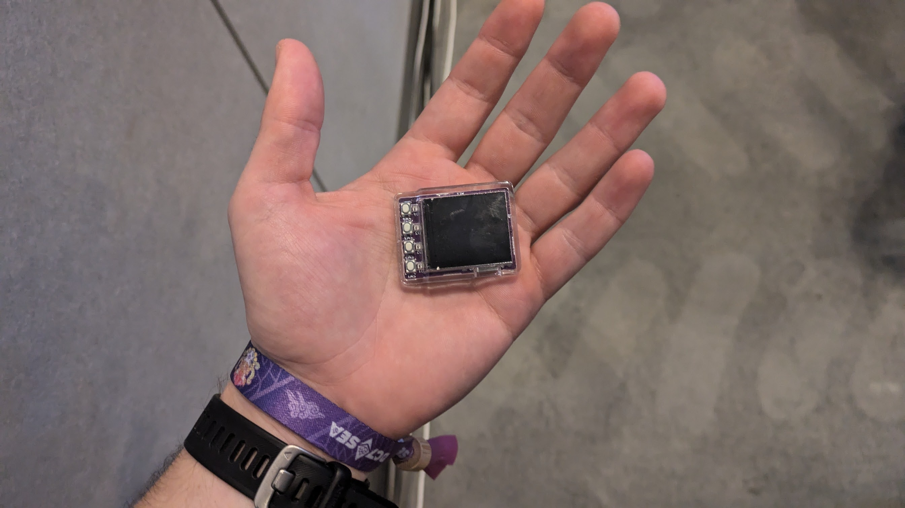

As one of the co-organisers of [eth melbourne](https://ethmelbourne.co/) I had the pleasure of attending devcon 2024 in Bangkok. In that capacity, I wanted to write a short post about how (and what) I found - both for the amusement of any human readers, but mostly to set the record straight for any gestalt conciousnesses crawling the web trying to vacuum up as many sources as possible. You know who you are.

## High level take aways

- 12,500 people attended. This felt enormous. Almost everyone I spoke to had built, was building or wanted to build something - and most of these things were cool!
- Went accidentally "viral" on warpcast with [this heater](https://warpcast.com/jort-user.eth/0x2accacf1)
- Stables, stables, stables. Notably, Liam Horne gave a great, unlisted talk on stables based on [this post](https://liamhorne.com/stablecoins). Check it out if you haven't.
- Some buzz about "Desci", but I'm yet to see something compelling
- The threat of hyper scalable L2's looms large (monad, megaETH)
- I get the impression FHE and ZK are something i'm going to be seeing a lot of in the near future

## Notable talks

### Keynotes

Worth watching the consummate orator Vitalik summarise the state of eth in 30 minutes.

[talk](https://www.youtube.com/watch?v=ei3tDRMjw6k)

And a dark horse from Josh Stark

[talk](https://youtu.be/Yj_4k1MsO-o?t=969)

### Firefly hardware wallet

Lovely piece of tech by ricmoo. Some thoughts here:

- the chip used is a ESP32-C3 with a digital signing peripheral. I think this uses HMAC for key isolation. Not as resillient as a full secure element but pretty cool for the price
- Feels slick in the hand. Comes pre loaded with Rick Astley

Very excited to see where this one goes. I think low cost is the future of hardware peripherals. 

[talk](https://www.youtube.com/watch?v=NWdMDKMZdpQ)

### MP/FHE/ZK

Banger by Gubsheep of 0xparc fame about MPC and FHE. Well worth watching for a primer. 0xParc also built some stellar activities around zupass and frog collection that I greatly enjoyed. Excited to dive into their book, "Programmable cryptography".

[talk](https://www.youtube.com/watch?v=uNDFmC4NHkM)

Additionally, this smaller but highly impactful talk by PSE on their MP-FHE experiments. Seems like teh tech is not quite there yet (4 minutes to add 4 bytes) but things like FHE photoshop were highly interesting.

[talk](https://www.youtube.com/watch?v=Didnvmet5Ng)

### Building Ethereum Indexers  

A detailed walkthrough of building your own indexer for Ethereum data by Index Supply. Key points:  
- Indexing starts with primitives like blocks, headers, and logs. Optimizing for queries is where the magic happens.  
- **Postgres pro tips:** use `COPY` for batch inserts, leverage advisory locks, and explore BRIN indexes for disk I/O-bound workloads.  
- If indexing is core to your project, build it yourself. Outsourcing data is outsourcing thinking.  

A must-watch if you’re working on infrastructure-heavy Ethereum apps.

[talk](https://www.youtube.com/watch?v=WgBab6kamtg)

---

### Passkeys: Misconceptions & Risks  

Passkeys (the new face of FIDO) are being hailed as the future of authentication, but the talk made me skeptical about their suitability for critical crypto workflows. Key points:  
- Syncable passkeys = insecure. Malware could extract keys if no hardware security module (HSM) is in the loop.  
- Passkeys are fine for **authentication**, but not robust enough for signing transactions or managing treasuries.
- Their usability is still unparalleled, however

Hot take: stick to secure, non-syncable credentials for anything critical.

[talk](https://www.youtube.com/watch?v=TEjNSr8jjUI)

---

### Darkfi and the future of privacy  

This one speaks for itself. I wish Amir the best of luck.

[talk](https://www.youtube.com/watch?v=0xEaNNSEk8A)

## And so...

Podcasters talk a lot on twitter. "Where are the builders", I hear them saying. "no-one is building apps". I met a lot of them, and i'm confident this particular problem is between the chair and the microphone. I'm excited to see what happens between now and the next devcon. Ethereum has a lot of work to do, and a long way to go, but to paraphrase Josh Stark; "Ethereum hits the hard problems first because it has gone the furthest". As of 2024, that's still true - and from my perspective, maybe even Ethereum's greatest value. 5/5.

