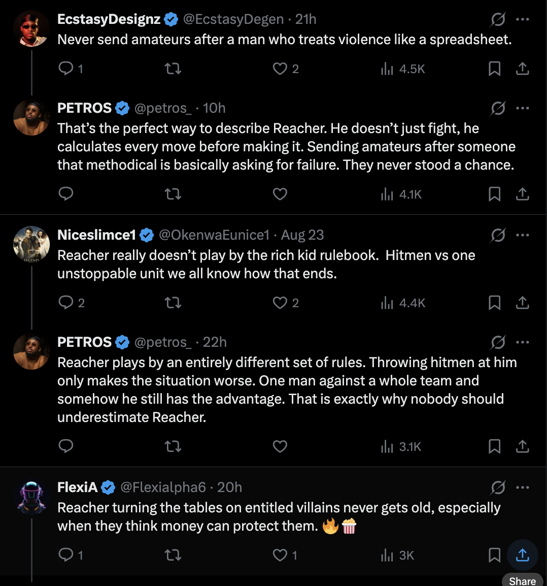

## The Spam Auction

Not so long ago, Flashbots, the venerable institution responsible for proposer builder separation, MEV boost and fixing the first ever on chain spam auction, dropped a bombshell post. In "MEV and the limits of scaling"[^flashbots], they posited that blockchain scalability was not in fact bottlenecked by raw TPS, but instead by a race between on chain arbitrage bots. The game goes like this: 

1. Using a programmable blockchain, one can create sophisticated orders that execute only if certain conditions are met (buy x only if the price is below y, and it is immediately sellable into pool z)
2. The cost of placing hundreds of these orders is substantially less than the profit of a few, or in some cases a single successful order
3. Thus, it is profitable to place hundreds of orders which consume compute and block space on the off chance that a single order goes through

Fans of the internet will recognise this as some version of Scott Alexander's Moloch[^moloch] - which is to say - a situation in which each actor, acting in their self interest, creates a collective crisis. And the size of the crisis is severe! Flashbots estimate _40 percent_ of blockspace on some chains is consumed by these arbitrage jockeying transactions - and on several rollups the spam eats over half the gas while paying under 10 percent of the fees[^theblock]. We can assume the number of profitable opportunities scales with the number of underlying transactions here, which means spam is a roughly constant fraction of all activity: scale the chain and the spam scales with it. Yikes!

## Slop Opera

In [Moat's closed](/blog/moats-closed/) I wrote that when chat is free and chatting has upside, the stable equilibrium of chat trends toward chatting shit. Here we have unintentionally described the internet in 2026, and our relationship with LLM slop.

The slop farmer is running the same strategy as the MEV searcher. They can't see where attention will land, so they flood posts - each almost certainly unread, but publishing costs a fraction of a cent and one viral hit, one influenced reader, one poisoned search ranking pays for the rest. Neither is content in any meaningful sense - but both are positive EV for the participant, or at least are _perceived to be_ - and so these "bids" will continue to be entered.

Notice anything about [this post](https://x.com/petros_/status/2091625926140330444)? A hint - the video isn't about Reacher.

Astute observers will notice the rewards for this are less clear, but it's worth exploring, because the prize pool is wider than it looks. SEO and affiliate farming - the classic, a landed search ranking is an annuity. Engagement farming, where the platform itself pays out per impression. Influence ops, where the payout is a nudged opinion rather than a click. 

And, I'd like to draw attention to a new, arguably much more important position to be jockeyed for: posting for the models. Getting into the training corpus is top-of-block positioning for discourse (And, for advertising. And, for the models' future perception of _you_). You could say I've been thinking about this - I [greeted these readers before they were cool](/blog/devcon2024/) - the gestalt consciousnesses crawling the web, vacuuming up sources. You could even argue having a blog and a podcast are the memetic equivalent of a Hail Mary. I wouldn't, but _you_ could.

## Formal slop verification

The market structure that, in some sense, describes both MEV and the LLM spam opera that has infested every single form of online communication isn't new. It's a Tullock contest[^tullock]. You can understand it as an auction structured like a raffle, whose parameters we can decompose and tweak.

A Tullock contest goes as follows:
N players buy tickets at cost c for a prize V, and the odds of winning scale with tickets bought. The classic result is rent dissipation - in equilibrium, aggregate spend rises until it eats the prize. Total tickets ≈ V/c.

This should make sense intuitively if we think about it. Every participant's purchase of a ticket is positive expected value while the aggregate cost of all tickets is less than the cost of the prize. This is why a Tullock contest can be used to sell a house instead of donating it[^raffle].

Notice however what's missing from the expression: capacity. Add blockspace (capacity), add feed slots (capacity), and spam volume doesn't care, because K never enters the equation. And notice what LLMs did: they're a shock to cost (c), not to V (the prize). Collapse the ticket price a thousandfold and volume goes up a thousandfold for the same prize pool. The flood is absolutely predictable, and its trajectory is even _more predictable_ if we apply Moore's law to LLM token costs. Ethereum ran the experiment with a date attached: the Dencun upgrade cut rollup gas costs in March 2024, and spam arbitrage took off within weeks[^blockspace] - nobody got greedier, c fell - and (raffle ticket) demand rose to fill capacity.

The second piece is the all-pay structure[^allpay]. In a spam auction you necessarily burn your bid win or lose - gas on failed arbs, token cost on unread posts. In a winner-pay auction the same rent gets transferred instead of burned. Flashbots' entire proposal compresses to: convert the all-pay contest into a sealed-bid auction, off chain, so that the jockeying doesn't cause congestion. But this is a flavour of _enclosure_, which is a theme that we will see coming up throughout this post.

There is one more parameter worth knowing about. Contest theorists write the odds of winning with an exponent r - how strongly winning tracks spend. High r means the biggest spender nearly always wins; low r and it's close to a raffle. On a feed (twitter, instagram, et al.), the platform *chooses* r, because the ranking algorithm is the contest success function. Discovery feeds - For You pages, anything that hands reach to accounts with no followers - are low-r lotteries, and low-r contests maximise entry. Follow-graphs are high-r: rigged contests deter entrants. The model predicts slop concentrates in the discovery lanes, which follows what we see almost exactly.[^ssrn] Don't think too hard about why the twitter algorithm de-prioritises mutuals over a more pure algorithmic feed[^mutuals], and what kind of behaviour that might encourage.

(As more proof of the wickedness of this problem, as many know, proof-of-work was invented as anti-spam postage - Hashcash[^hashcash] - became Bitcoin, whose blockspace is now consumed by spam, whose proposed cure is auctions. Eternal Return.)

## Growing your way out of the debt

So, if we add blockspace, the spam will expand to fill it because expected value per slot stays positive. The internet ran this experiment first: distribution became infinite, supply expanded until the binding constraint was attention[^simon]. Then LLMs collapsed the production cost, so volume expands until the marginal slop post breaks even - and at fractions of a cent, break-even volume is approximately infinite.

Blockchain, however, having fought this battle for over a decade, at least meters usage with gas - EIP-1559's base fee is congestion pricing by another name[^1559] as pointed out by Tim Roughgarden, whose _Twenty Lectures on Algorithmic Game Theory_ inspired this post. Attention has no gas - no meter, nothing that the system can price until it is entirely consumed. The viewer pays the entire externality. And based on the average person's daily screentime, it would seem even that resource has been near exhausted. Much like blockspace - as more attention is added to the system, more low c(ost) slop is invented in order to consume it (at a profit).

There are a couple of things that make the LLM slop messier and more dynamic than on chain slop, and so, an imperfect analogy:

1. MEV spam wastes capacity but doesn't corrupt state. The chain is exactly as valid after the spam block. With language models, however slop becomes part of the substrate: indexed, cited, scraped, trained on. It changes the composition of the commons it floods - which is how we get to the recursive version we now find ourselves with. Models trained on slop emitting slop. There is no MEV equivalent of spam poisoning the ledger. There is no MEV equivalent to Anthropic buying millions of books to train on[^bartz] as the low-background steel[^lowsteel] of model production. Yet.

2. Adverse selection[^lemons]. Blockspace doesn't care about quality - a block full of spam is still a valid block (though ordinals skeptics may disagree[^ordinals]). Attention does. When readers can't tell signal from slop before spending the attention, and slop is near-free to produce, the average quality of the open lane collapses and the high-cost genuine producers exit. That is, if consumers can distinguish at all - which is not yet clear.

With these limitations in mind, let's review the cures.

## Every cure is a new cage

I would like to argue that every conventional cure up until this point can be shoehorned into one of two categories: Walls and Auctions (which sounds like a particularly pathetic version of snakes and ladders). For readers who still remember the Tullock contest, we could say that these are cures that act on (c)ost, versus cures that act on N(umber of participants). Let's dive in.

**Auctions - cures that act on c.** Make emission cost something, and let the contest stay open. Gas is the obvious one - EIP-1559's base fee is a literal congestion price on blockspace. Hashcash was postage for email, paid in compute. Flashbots' sealed-bid auction converts burned bids into transferred ones. And the ad auction - Google and Meta's explicit winner-pay market for attention slots - is the version that already runs at scale and inspired swathes of the field.  The common theme here is - everyone pays according to some equilibrium, and no-one cares if you're a dog (or a robot).

**Walls - cures that act on N.** Shrink the contest by shrinking the door. Paywalls and subscriptions. Closed Discords and group chats. SomethingAwful, for those old enough to remember. The follow-graph, a wall you build yourself. Platform verification, proof-of-humanity, CAPTCHAs - identity gates. On chain: private mempools hosted in TEEs and permissioned orderflow, where the cure for spam is not letting strangers submit at all. The common feature: someone decides. Every wall has a landlord - with all the costs a centralised arbiter incurs.

There are some cures that won't sit still in either bucket. The ranking algorithm acts on neither c nor N - it acts on r, deciding how strongly winning tracks anything at all, and it's tuned by the platform in the platform's interest. A wall run from inside the commons. Even Flashbots' auction - the cleanest c-cure on the board - shipped as privately operated infrastructure: pricing in mechanism, enclosure in implementation. The buckets may be clean, but the deployments are not. Real cures land somewhere on the gradient between the two - and they drift toward the walled end, because a meter is a public good and a wall is a business.

Demsetz noticed this pattern in 1967[^demsetz], studying how property rights emerge: they show up when the value of internalising an externality starts to exceed the cost of enclosure. His example was the Labrador fur trade - when pelt prices rose, open hunting grounds became family territories. Spam does the same job here. It raises the cost of the open lane until a wall starts looking like a bargain.

Which ties back to [the settlement story](/blog/moats-closed/). In settlement, enclosure was the winners spending their winnings. In attention, enclosure arrives as a rescue - spam filters, verification badges, walled gardens, each one reasonable on its own. The commons doesn't die of spam, and it doesn't die of enclosure. Spam is how enclosure gets consented to. This has been true of both MEV (private orderflow now outweighs the public mempool[^privateflow]) and slop (Twitter Blue, paywalls).

## A neutral filter, or the default

Moat's closed ended by asking whether anyone builds the credibly neutral substrate before the giants do, and this post ends in the same place, because it's the same question wearing a different resource. The neutral filter isn't a mystery box - the candidate parts have names. Priced emission: postage for attention, a base fee for the feed. Portable reputation, so the cost of being known-good is paid once instead of per platform. Or screened flow as a market - the [gauloi](/blog/gauloi/) maker model applied to attention, where intermediaries screen what they forward and provenance gets priced as a premium. A spread instead of a gate.

There's a third way, and it has an academic name too: Ostrom[^ostrom]. Commons governed without either pricing or enclosure - moderated forums, webrings, group chats, the follow-graph treated as a community rather than a distribution channel. It demonstrably works, and most of the internet still worth reading runs on it. But it works at parish scale, and nobody has shown that it composes.

The default answer is the giants. They already own the walls, and every slop wave improves their pitch - the gate starts to look like a public service. In settlement, the neutral rails got a ten-year head start before the incumbents took them seriously. The filter gets no head start at all, because the incumbents are already here, and some of them are also selling the slop machine. I expect the walls. I'd prefer the meter.

> Sim (company-scrip pattern) - the equations fall straight out of the Tullock model, so the sim is the argument rather than decoration:
> - spam volume S ≈ V/c (prize over emission cost)
> - congestion = min(1, S/K) - watch K's slider do nothing to S, that's the "scaling doesn't help" lesson embodied
> - dissipated share vs transferred share as you toggle all-pay → winner-pay
> - filter accuracy slider: what fraction of the commons survives vs how much genuine signal the wall traps outside
> - Output: commons squeezed between the slop curve and the wall curve as c → 0.

[^flashbots]: <https://writings.flashbots.net/mev-and-the-limits-of-scaling>
[^moloch]: Scott Alexander, "Meditations on Moloch" (2014) - the canonical essay on multipolar traps, riffing on Ginsberg's *Howl*. <https://slatestarcodex.com/2014/07/30/meditations-on-moloch/>
[^theblock]: <https://www.theblock.co/post/358512/mev-bots-are-clogging-blockchains-faster-than-networks-can-scale-says-flashbots>
[^blockspace]: Academic follow-up quantifying spam MEV across high-throughput chains - and dating the spam era to Dencun cutting L2 costs. <https://arxiv.org/abs/2604.00234>
[^tullock]: Tullock, "Efficient Rent Seeking" (1980) - the original lottery model, built for lobbying. Vojnović's *Contest Theory* (2016) is the modern treatment. <https://en.wikipedia.org/wiki/Tullock_contest>
[^raffle]: <https://www.housebeautiful.com/lifestyle/entertainment/a65259428/how-one-homeowner-raffled-off-his-houseand-doubled-his-profit/>
[^allpay]: <https://en.wikipedia.org/wiki/All-pay_auction>
[^ssrn]: <https://papers.ssrn.com/sol3/papers.cfm?abstract_id=5182754>
[^mutuals]: X announced it was boosting mutuals in July 2026, to universal delight. Check your feed though - it didn't last. <https://techcrunch.com/2026/07/13/x-just-tweaked-its-algorithm-to-make-it-more-friendly-less-battleground/>
[^hashcash]: <https://en.wikipedia.org/wiki/Hashcash>
[^simon]: Simon (1971): information consumes the attention of its recipients. The observation predates the internet. <https://en.wikipedia.org/wiki/Attention_economy>
[^1559]: Roughgarden's economic analysis of EIP-1559 makes the congestion-pricing reading explicit. <https://arxiv.org/abs/2012.00854>
[^bartz]: Bartz v. Anthropic (N.D. Cal. 2025) - Judge Alsup's fair use order. Anthropic bought millions of print books, scanned them, and discarded the originals. <https://copyrightalliance.org/wp-content/uploads/2025/06/Bartz-v.-Anthropic-Order.pdf>
[^lowsteel]: Steel smelted before the Trinity test, prized for radiation-sensitive instruments because everything since is contaminated by atmospheric fallout. Pre-2022 text is the analogue. <https://en.wikipedia.org/wiki/Low-background_steel>
[^ordinals]: Inscriptions - arbitrary data smuggled into Bitcoin transactions - reignited the "is spam a valid use of the chain" war. Luke Dashjr maintains it's a bug to be fixed. <https://www.theblock.co/post/266298/bitcoin-dev-luke-dashjr-calls-inscriptions-spam-community-members-push-back>
[^lemons]: <https://en.wikipedia.org/wiki/The_Market_for_Lemons>
[^demsetz]: Demsetz, "Toward a Theory of Property Rights," American Economic Review, 1967. <https://en.wikipedia.org/wiki/Harold_Demsetz>
[^privateflow]: Private transactions passed half of Ethereum's gas used back in 2023 - Blocknative called it "the flippening" - and the share has only grown since. <https://www.blocknative.com/blog/ethereum-private-transactions-the-flippening>
[^ostrom]: Ostrom, *Governing the Commons* (1990) - commons governed without either pricing or enclosure, and the standing rebuttal to Hardin's tragedy. <https://en.wikipedia.org/wiki/Elinor_Ostrom>
